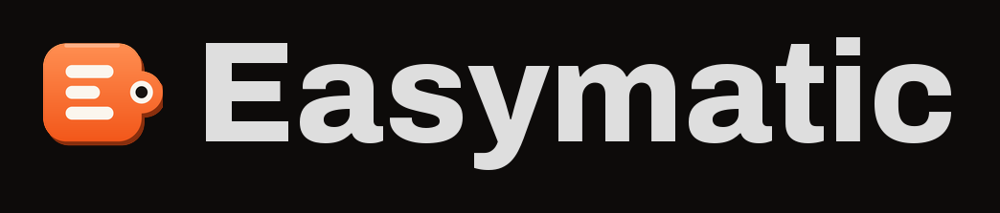

<div align="center">



**An Android automation app you build by wiring nodes on a canvas.**

[](https://github.com/m1n1m1/Easymatic/actions/workflows/android.yml)
[](https://github.com/m1n1m1/Easymatic/actions/workflows/website.yml)
[](https://github.com/m1n1m1/Easymatic/actions/workflows/instrumentation.yml)

[](LICENSE)


[Website](https://easymatic.app) ·
[Documentation](https://easymatic.app/docs/) ·
[Your first macro](https://easymatic.app/docs/start/first-macro/) ·
[Node reference](https://easymatic.app/docs/#node-reference)

</div>

---

Easymatic turns "when this happens, do that" into a picture. You drag nodes onto a
canvas, connect them with wires, and a foreground service runs the result in the
background — even when the app is closed.

A macro is built from four kinds of node:

- **Triggers** say *when* something happens — a shake, a geofence crossing, an incoming
  message, a schedule, an NFC tag.
- **Actions** say *what to do about it* — post a notification, make an HTTP call, switch
  a light, run a JavaScript snippet.
- **Values** read the phone *right now* — battery level, Wi-Fi network, screen state.
- **Transforms** reshape data on the way through — parse JSON, format text, convert a
  type.

There are **184 nodes** today: 56 triggers, 85 actions, 32 values and 11 transforms.
Each one has its own page, with ports and settings, in the
[node reference](https://easymatic.app/docs/#node-reference).

## Getting the project running in Android Studio

### What you need first

| Requirement | Version | Note                                                                                                        |
| --- | --- |-------------------------------------------------------------------------------------------------------------|
| Android Studio | A current stable release | It has to understand Android Gradle Plugin 9.4. If the IDE refuses to sync, update it before anything else. |
| JDK | 21 | Android Studio ships one, so you rarely install this yourself. CI uses Temurin 21.                          |
| Android SDK | Platform 37 | Android Studio offers to install it during the first sync.                                                  |
| A device | Android 8.0 (API 26) or newer | A real phone beats an emulator here — see the note at the end of this section.                              |

Gradle itself is **not** a prerequisite. The wrapper in the repository downloads the
right version (9.6.1) on the first build.

### Step 1: Clone the repository

```
git clone https://github.com/m1n1m1/Easymatic.git
```

### Step 2: Open the root folder

In Android Studio, choose **File → Open** and select the `Easymatic` folder itself — the
one holding `settings.gradle.kts`. Do not open `app/`. Opening a subfolder gives you a
project with no modules and a long list of unresolved references.

### Step 3: Let the first sync finish

Android Studio starts a Gradle sync on its own. The first one downloads Gradle, the SDK
components and every dependency, so give it a few minutes. If the IDE shows a banner
about a missing SDK platform, accept it.

When the sync is done, the project view shows four modules:

```
Easymatic
├── app             the app itself
├── node-api        the node declaration surface
├── plugin-sdk      what a third-party plugin compiles against
└── sample-plugin   a worked example plugin
```

### Step 4: Add a Google Maps API key (optional)

The geofence place editor draws a Google map, and a map needs a key. Create
`local.properties` in the repository root if it is not there yet, and add one line:

```
MAPS_API_KEY=AIza…
```

Create the key in the [Google Cloud Console](https://console.cloud.google.com/) with
**Maps SDK for Android** enabled.

> **Note:** This step really is optional. Without a key the project still builds and
> runs — the map area just stays blank, and every other control in the place editor keeps
> working. `local.properties` is gitignored, so your key never reaches the repository.

### Step 5: Run the app

Pick the **app** run configuration, choose your device, and press **Run**
(`Shift + F10`).

### Step 6: Allow what the app asks for

Easymatic runs your macros from a foreground service, so Android has to let it. After the
first launch, open the **Permissions** screen in the app and grant what your macros need
— at minimum notifications, so the service can show its status. Every node also states
its own requirements on its card, and the editor's Problems panel warns you when a grant
is missing.

> **Note on emulators:** an emulator is fine for the editor, the graph and most actions.
> Geofences, NFC, real sensors, telephony and the messenger integrations need a physical
> phone.

## Building from the command line

Always use the Gradle wrapper — `.\gradlew.bat` on Windows, `./gradlew` elsewhere.

| Command | What it does |
| --- | --- |
| `.\gradlew.bat assembleDebug` | Builds the debug APK |
| `.\gradlew.bat test` | Runs the unit tests |
| `.\gradlew.bat detekt` | Runs static analysis — it fails on any finding |
| `.\gradlew.bat lintDebug` | Runs Android Lint — it fails on any error |
| `.\gradlew.bat connectedAndroidTest` | Runs the instrumentation tests, so a device or emulator has to be attached |

Before you push, run the same three tasks CI runs:

```
.\gradlew.bat assembleDebug test detekt
```

> **Note:** the configuration cache is enabled. If a build behaves strangely after you
> move files around, add `--no-configuration-cache` once.

## Cutting a release

Release notes are written in one place, [`CHANGELOG.md`](CHANGELOG.md). The Play Store
text, the GitHub release and the website's changelog page are all generated from it, and
so is the app's own version number. You never edit a version in `build.gradle.kts`.

### Step 1: Write the entry

Add a section at the top of `CHANGELOG.md`, under `## [Unreleased]`:

```
## [0.2.0-alpha] - 2026-09-14
code: 200

Play: One short paragraph for the Play Store. 500 characters at most.

### Added
- What you added, one line per bullet.

### Fixed
- What you fixed.
```

`code:` is the Play `versionCode`. It has to be higher than every release before it —
Play rejects an upload that repeats one. Section headings come from a fixed list: Added,
Changed, Fixed, Removed, Deprecated and Security.

The version may carry a pre-release suffix, as `0.2.0-alpha` does. That suffix is the only
thing marking a release as a pre-release: the GitHub release is flagged from it, and the
website labels it. Drop the suffix and the same release is a final one.

> **Note:** the `Play:` paragraph is separate from the bullets because the Play Store cuts
> release notes off at 500 characters, and the other places have no limit. Leave it out and
> the bullets are used instead — which fails the build if they do not fit.

### Step 2: Regenerate

```
.\gradlew.bat :app:testDebugUnitTest --tests "*ChangelogExportTest*" -PregenerateChangelog=true
```

This writes `docs/changelog.generated.json` and the Play text under `fastlane/`. Both are
committed, and the same test fails the build when they no longer match `CHANGELOG.md`.

### Step 3: Commit and tag

```
git commit -am "Release 0.2.0-alpha"
git tag v0.2.0-alpha
git push origin main v0.2.0-alpha
```

The tag creates the GitHub release, with the notes taken from the changelog. A tag that
does not name the newest entry is refused.

### Step 4: Upload to Play

Build the bundle with `.\gradlew.bat :app:bundleRelease`, then upload it together with the
generated text in `fastlane/metadata/android/en-US/changelogs/<versionCode>.txt`. A
pre-release belongs on a closed testing track rather than production.

Signing reads `keystore.properties` at the repository root — gitignored, the same shape as
`local.properties`:

```
storeFile=C:/path/outside/the/repo/upload-key.jks
storePassword=…
keyAlias=upload
keyPassword=…
```

Create the key once with `keytool -genkeypair -v -keystore upload-key.jks -keyalg RSA
-keysize 2048 -validity 10000 -alias upload`, keep it outside the checkout, and back it up.
Enrol in Play App Signing so Google holds the key the shipped app is signed with; this one
only proves who uploaded the bundle, and can be replaced through the console if it is lost.

> **Note:** the upload itself is still manual. There is no Play service account and no
> publisher plugin, so nothing is pushed automatically. Without a `keystore.properties` the
> release variant still builds — it is simply unsigned, which Play rejects at upload.

## How the project is laid out

The code sits in four Gradle modules. Which module a file is in tells you something the
package name does not: whether a third-party plugin can compile against it.

| Module | What it is |
| --- | --- |
| `:app` | The executor, the platform adapters and the whole UI. |
| `:node-api` | The node *declaration* surface — ids, permissions, item schemas, ports, config annotations and `NodeSchema`. A plain Kotlin JVM library with one dependency and no `android.jar`, so an Android import here is a compile error. Plugins compile against it. |
| `:plugin-sdk` | The Android half a plugin needs: the AIDL both sides compile, the service base class and the six node contracts. |
| `:sample-plugin` | A worked plugin. Executable documentation — built by `test` and `connectedAndroidTest`, not by `assembleDebug`. |

Inside `:app` the packages under `io.github.m1n1m1.easymatic` are `core/`, `domain/`,
`engine/`, `data/` and `feature/`, and they may depend on each other in one direction
only. [`ARCHITECTURE.md`](ARCHITECTURE.md) has the rules.

## Continuous integration

Three GitHub Actions workflows live in [`.github/workflows/`](.github/workflows/). The
badges at the top of this page report the first two.

| Workflow | Runs on | What it does |
| --- | --- | --- |
| `android.yml` | Push to `main`, pull requests | Two jobs. **Build**: `assembleDebug test detekt`. **Android Lint**: `lintDebug`, kept separate so a lint failure can never hide the build result. |
| `website.yml` | Push or PR touching `website/**` or `docs/**` | `npm ci && npm run build`, then fails if the committed `website/src/styles/tokens.css` is stale. |
| `instrumentation.yml` | Mondays at 03:00 UTC, or on demand | `:app:connectedDebugAndroidTest` on an API 36 `google_apis` emulator. One run costs 10–15 minutes, which is why it does not gate a commit. |

Two details there are deliberate and easy to break by accident:

- **CI never passes `-PregenerateNodeStrings` or `-PregenerateNodeDocs`.** Those flags
  turn `NodeStringsSyncTest` and `NodeDocsExportTest` from guards into writers, so a run
  with them set would go green after quietly rewriting committed sources.
- **`android.yml` has no path filters.** The unit tests read `docs/nodes.generated.json`
  and `docs/nodes/*.md`, so a docs-only commit can legitimately turn the build red.
  Filtering would let exactly the riskiest commits skip CI.

`MAPS_API_KEY` is an *optional* repository secret. Without it CI stays green, the same
way a local build does.

## Documentation

The full documentation is on the website:
**<https://easymatic.app/docs/>**

| Page | What is in it |
| --- | --- |
| [Install and first run](https://easymatic.app/docs/start/install/) | What to install, what to allow, and the two screens the app is made of |
| [Your first macro](https://easymatic.app/docs/start/first-macro/) | Build, wire, run and arm a working macro from an empty canvas |
| [The editor](https://easymatic.app/docs/start/editor/) | The canvas, the palette, the node card and the bottom bar |
| [Node reference](https://easymatic.app/docs/#node-reference) | Every node, with its ports, settings and permissions |

In the repository:

| File | What is in it |
| --- | --- |
| [`CHANGELOG.md`](CHANGELOG.md) | Every release, and the only place release notes are written |
| [`ARCHITECTURE.md`](ARCHITECTURE.md) | Modules, packages and the dependency rules between them |
| [`docs/ADDING_NODES.md`](docs/ADDING_NODES.md) | The step-by-step procedure for adding a node |
| [`docs/PLUGINS.md`](docs/PLUGINS.md) | Writing a plugin app that adds its own nodes |
| [`docs/EXTERNAL_API.md`](docs/EXTERNAL_API.md) | Driving Easymatic from another app through the process API |
| [`website/README.md`](website/README.md) | Running and editing the website |

## License

Easymatic is released under the MIT License. See [`LICENSE`](LICENSE) for the full text.
